---
## Author
author:
  name: Альманасра Рами
  degrees: студент НКАбд-02-24
  email: 1032235862@rudn.ru
  affiliation:
    - name: Российский университет дружбы народов
      country: Российская Федерация
      postal-code: 117198
      city: Москва
      address: ул. Миклухо-Маклая, д. 6

## Title
title: "Лабораторная работа №1"
subtitle: "Установка и конфигурация операционной системы на виртуальную машину"
license: "CC BY"
lang: ru
format: typst
---

# Цель работы

Целью данной работы является приобретение практических навыков установки операционной системы на виртуальную машину, настройки минимально необходимых для дальнейшей работы сервисов.

# Задание

- Установить Linux (Rocky) на виртуальную машину VirtualBox.
- Выполнить базовую конфигурацию системы и сетевых параметров.
- Подготовить систему для выполнения последующих лабораторных работ.

# Теоретическое введение

Виртуализация позволяет запускать гостевые операционные системы в изолированной среде на одном физическом компьютере. Для учебных задач удобно использовать VirtualBox, который поддерживает создание виртуальных дисков, настройку ресурсов и подключение ISO-образов для установки ОС. После установки важно выполнить базовую настройку системы: задать имя хоста, создать пользователя, настроить сеть и убедиться в корректной работе окружения

# Выполнение лабораторной работы

## Создание виртуальной машины

Открываем VirtualBox и создаём новую виртуальную машину
Указываем имя виртуальной машины, определяем тип операционной системы и указываем путь к iso-образу ([рис. @fig-001]) 

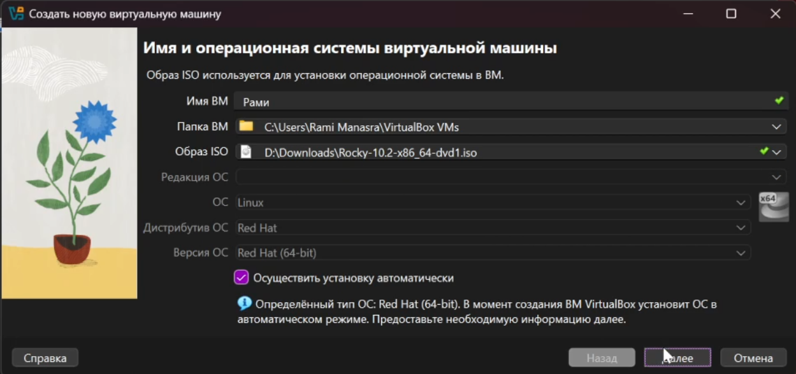{#fig-001 width=70%}

Далее указываем размер оперативной памяти виртуальной машины - 2048 МБ, число процессоров - 2 и задаём размер виртуального жёсткого диска - 40 ГБ ([рис. @fig-002])

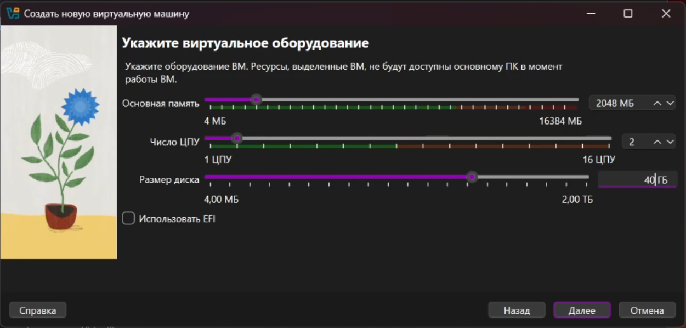{#fig-002 width=70%}

## Установка операционной системы

После запуска устанавливаем английский язык интерфейса ([рис. @fig-004])

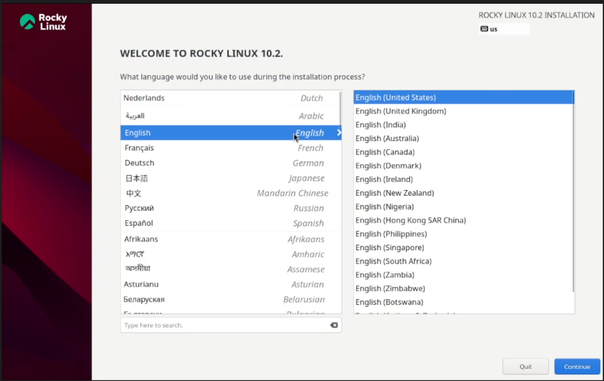{#fig-004 width=70%}

Добавляем русскую раскладку клавиатуры ([рис. @fig-005])

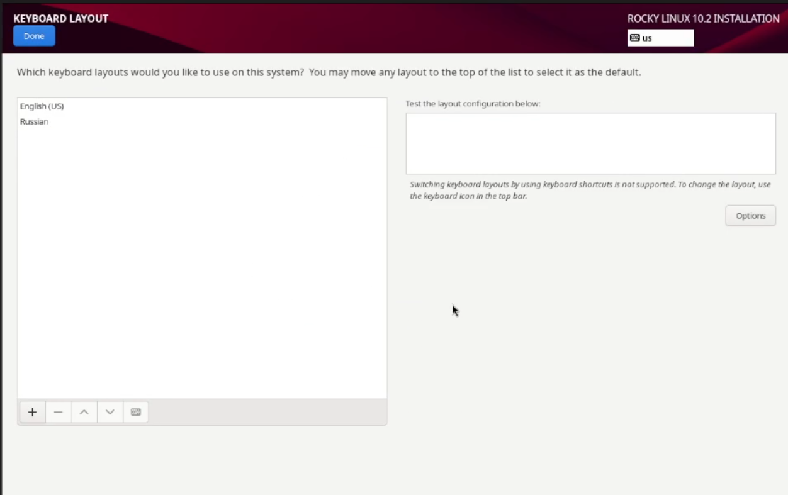{#fig-005 width=70%}

В разделе выбора программ указываем в качестве базового окружения Server with GUI, а в качестве дополнения — Development Tools ([рис. @fig-007])

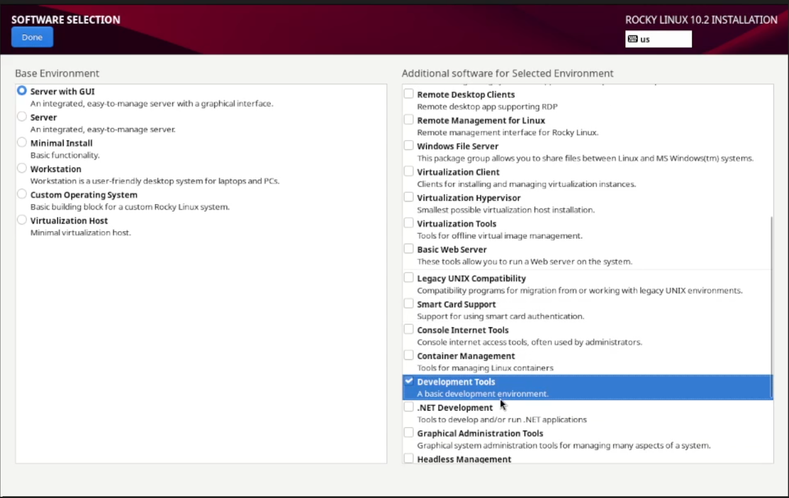{#fig-007 width=70%}

Далее отключаем KDUMP, а место установки ОС оставляем без изменения ([рис. @fig-008]), ([рис. @fig-009])

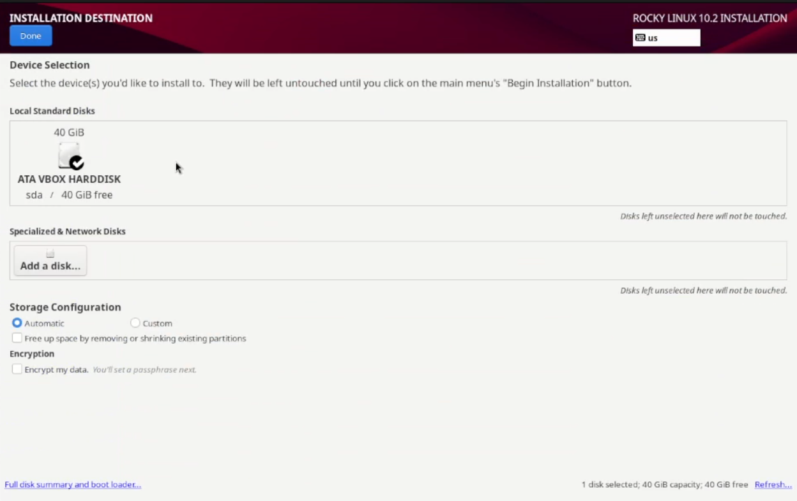{#fig-008 width=70%}

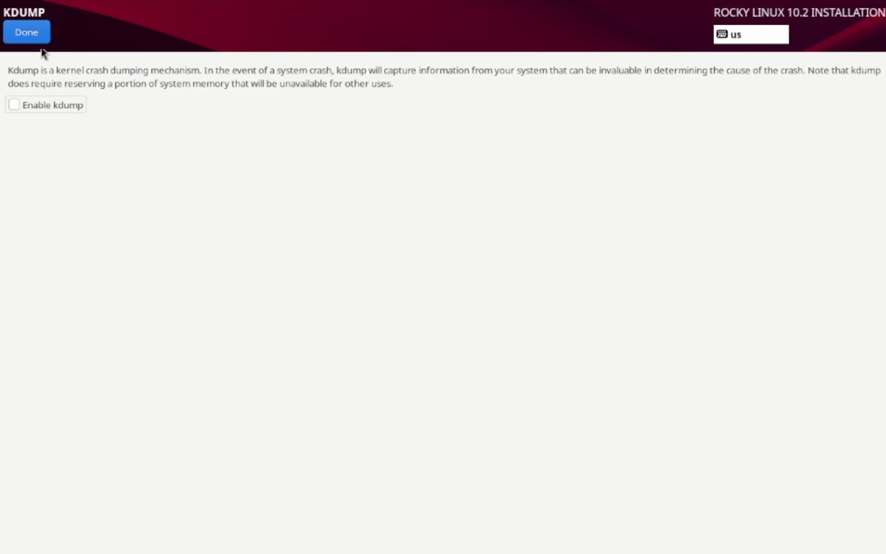{#fig-009 width=70%}

Устанавливаем пароль для root, разрешение на ввод пароля для root при использовании SSH ([рис. @fig-011])

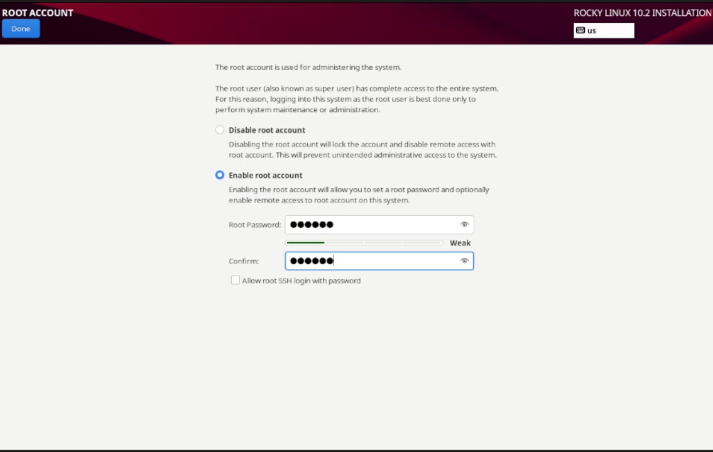{#fig-011 width=70%}

Затем задаём локального пользователя с правами администратора и пароль для него ([рис. @fig-012]) 

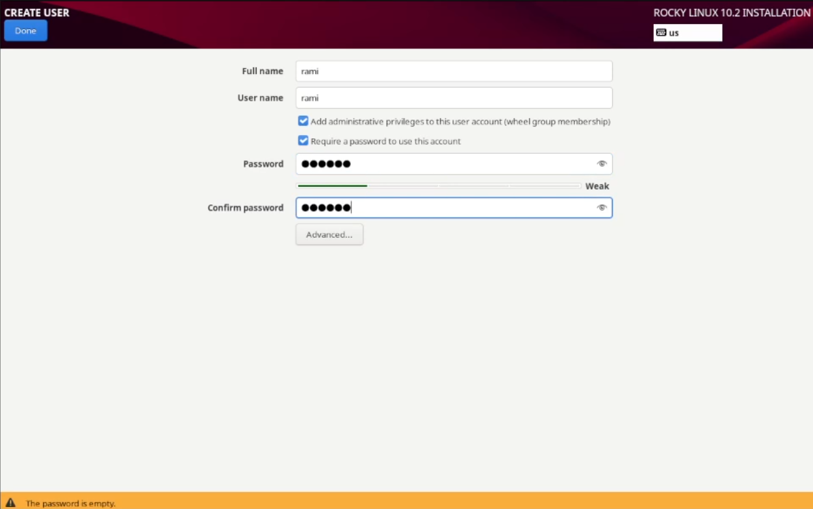{#fig-012 width=70%}

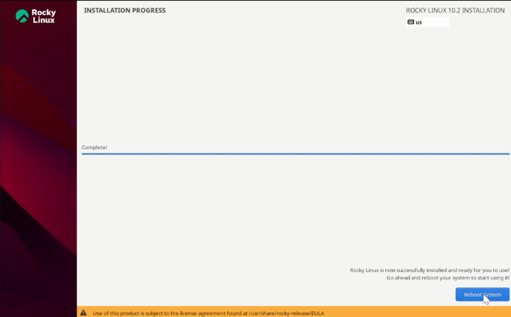{#fig-014 width=70%} 

## После установки

Далее через терминал подключаем образ диска дополнений гостевой ОС: ([рис. @fig-015])

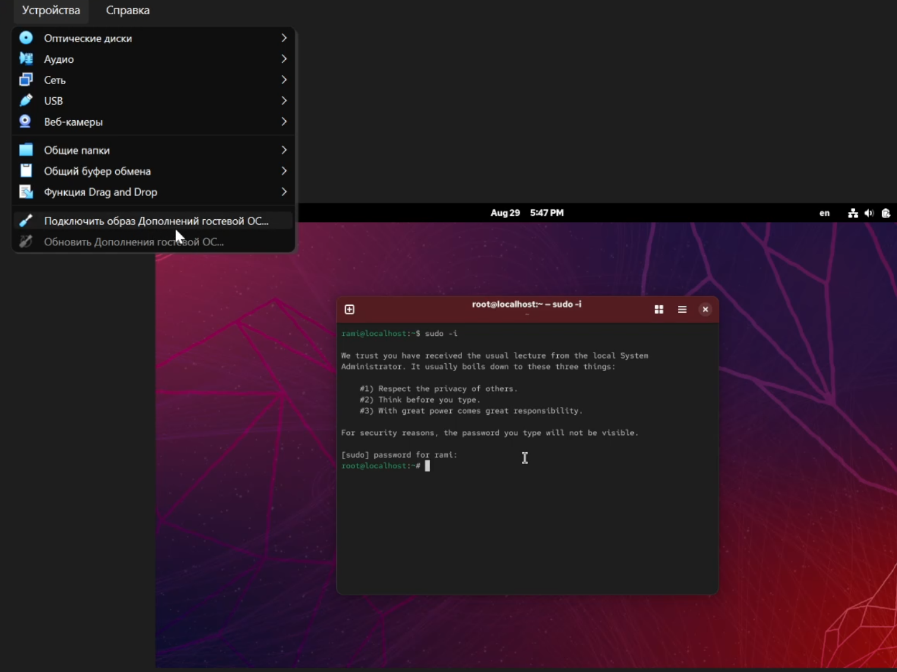{#fig-015 width=70%}

# Домашнее задание

1. Версия ядра Linux (Linux version) ([рис. @fig-018])
2. Частота процессора (Detected Mhz processor) ([рис. @fig-019])
3. Модель процессора (CPU0) ([рис. @fig-020])
4. Объем доступной оперативной памяти (Memory available) ([рис. @fig-021])
5. Тип обнаруженного гипервизора (Hypervisor detected) ([рис. @fig-022])
6. Тип файловой системы корневого раздела ([рис. @fig-023])

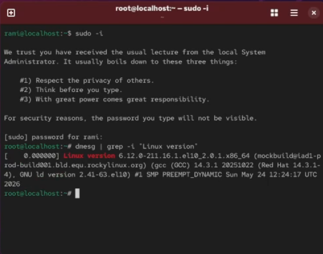{#fig-018 width=70%}

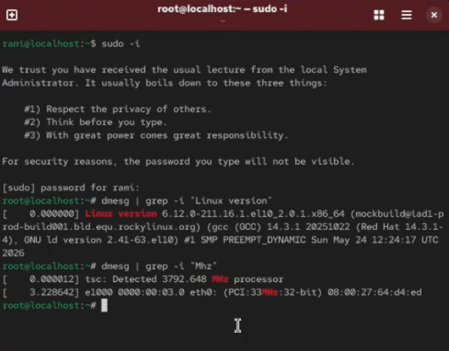{#fig-019 width=70%}

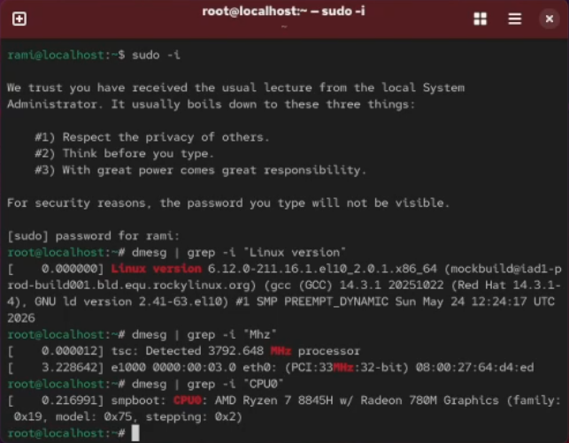{#fig-020 width=70%}

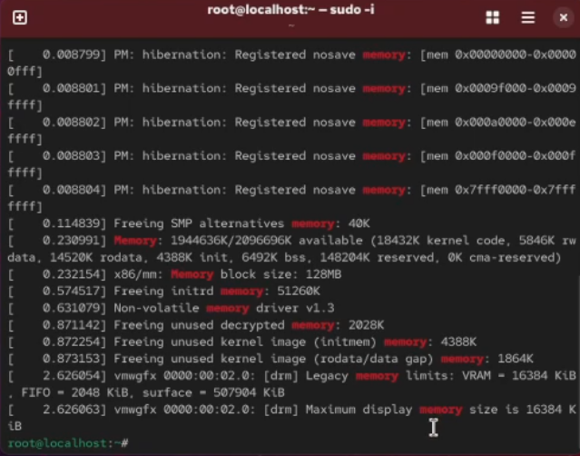{#fig-021 width=70%}

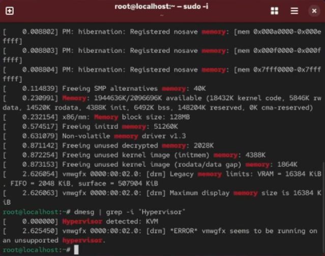{#fig-022 width=70%}

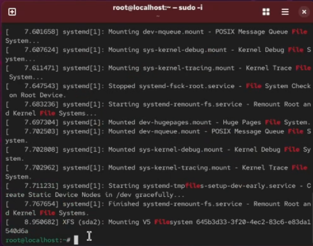{#fig-023 width=70%}
 
# Контрольные вопросы + ответы

1. Какую информацию содержит учётная запись пользователя?

Учётная запись, как правило, содержит сведения, необходимые для опознания пользователя при подключении к системе, сведения для авторизации и учёта. Это идентификатор пользователя (login) и его пароль.

2. Укажите команды терминала и приведите примеры:

- для получения справки по команде используют *help*

- для перемещения по файловой системе используют *cd*

- для просмотра содержимого каталога используют *ls*

- для определения объёма каталога используют *du*

- для создания/удаления каталогов используют *mkdir/rmdir*, а для файлов *touch/rm*

- для задания определённых прав на файл/каталог используют *chmod*

- для просмотра истории команд используют *history*

3. Что такое файловая система? Приведите примеры с краткой характеристикой.

Файловая система (англ. file system) — порядок, определяющий способ организации, хранения и именования данных во внешней памяти, и обеспечивающий пользователю удобный интерфейс при работе с такими данными. Простыми словами файловая система - это система хранения файлов и организации каталогов. От файловой системы зависит, как файлы будут кодироваться, храниться на диске и читаться компьютером.

Примеры:

- FAT (англ. File Allocation Table «таблица размещения файлов») — классическая архитектура файловой системы, которая из-за своей простоты всё ещё широко применяется для флеш-накопителей. Используется в дискетах, картах памяти и некоторых других носителях информации. Ранее находила применение и на жёстких дисках.

- NTFS (англ. new technology file system — «файловая система новой технологии») — стандартная файловая система для семейства операционных систем Windows NT фирмы Microsoft.

- Ext4 (англ. fourth extended file system, ext4fs) — журналируемая файловая система, используемая преимущественно в операционных системах с ядром Linux, созданная на базе ext3 в 2006 году.

4. Как посмотреть, какие файловые системы подмонтированы в ОС?

Следует ввести команду df. 

5. Как удалить зависший процесс?

Чтобы удалить зависшй процесс, надо сначала узнать его PID с помощью команды *ps*. А после этого ввести *kill <PID процесса>*. И всё готово!

# Выводы

В ходе выполнения лабораторной работы мы приобрели практические навыки установки операционной системы на виртуальную машину, настройки минимально необходимых для дальнейшей работы сервисов.

# Список литературы{.unnumbered}

Лаборатораня работа №1 [Электронный ресурс] URL:https:{//esystem.rudn.ru/pluginfile.php/3096704/mod_folder/content/0/001-lab_virtualbox.pdf}