---
## Author
author:
  name: Альманасра Рами
  degrees: студент НКАбд-02-24
  email: 1032235862@rudn.ru
  affiliation:
    - name: Российский университет дружбы народов
      country: Российская Федерация
      postal-code: 117198
      city: Москва
      address: ул. Миклухо-Маклая, д. 6

## Title
title: "Лабораторная работа №4"
subtitle: "Дисциплина: Основы информационной безопасности"
license: "CC BY"
lang: ru
format: typst
---

# Цель работы

Получить практические навыки по работе в консоли с расширенными атрибутами файлов.

# Выполнение лабораторной работы

От имени пользователья geust определяю расширенные атрибуты файла dir1/file1.

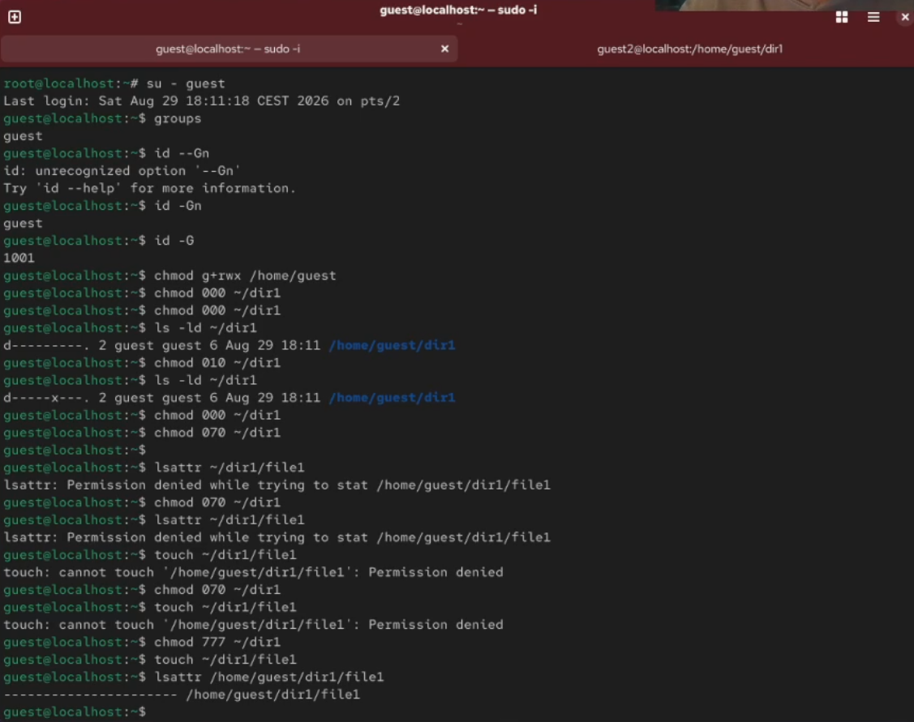{#fig:001}

Изменяю права доступа для файла с помощью chmmod 600.

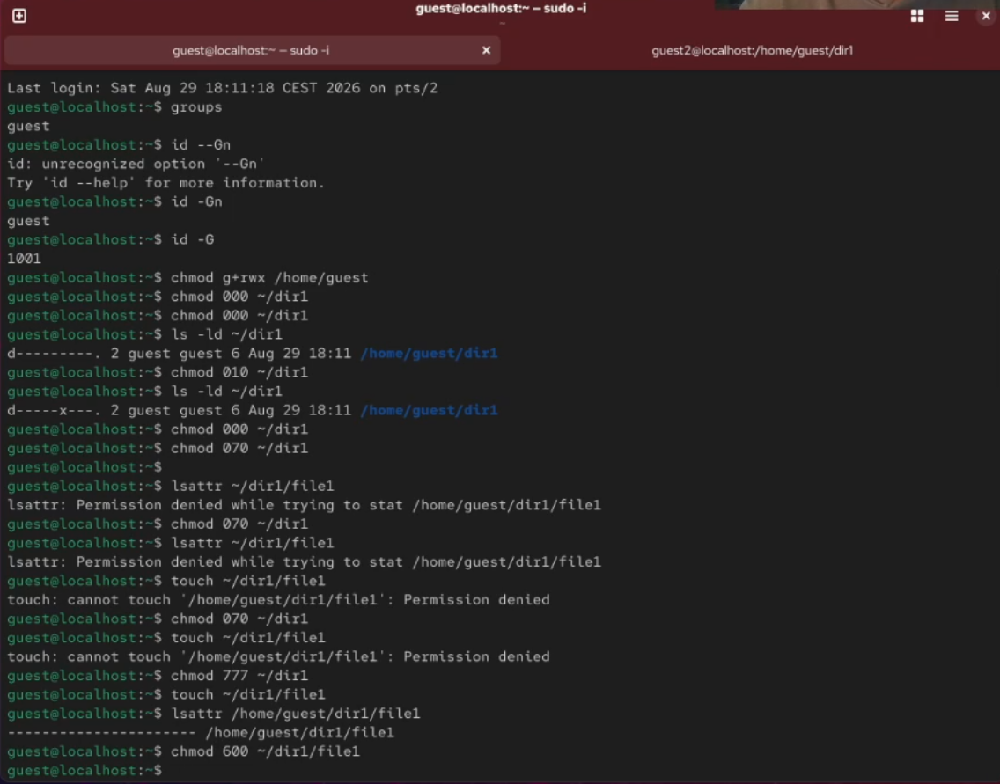{#fig:002}

Устанавливаю расширенный атрибут от имени пользователя guest и получаю отказ действия в ответе.

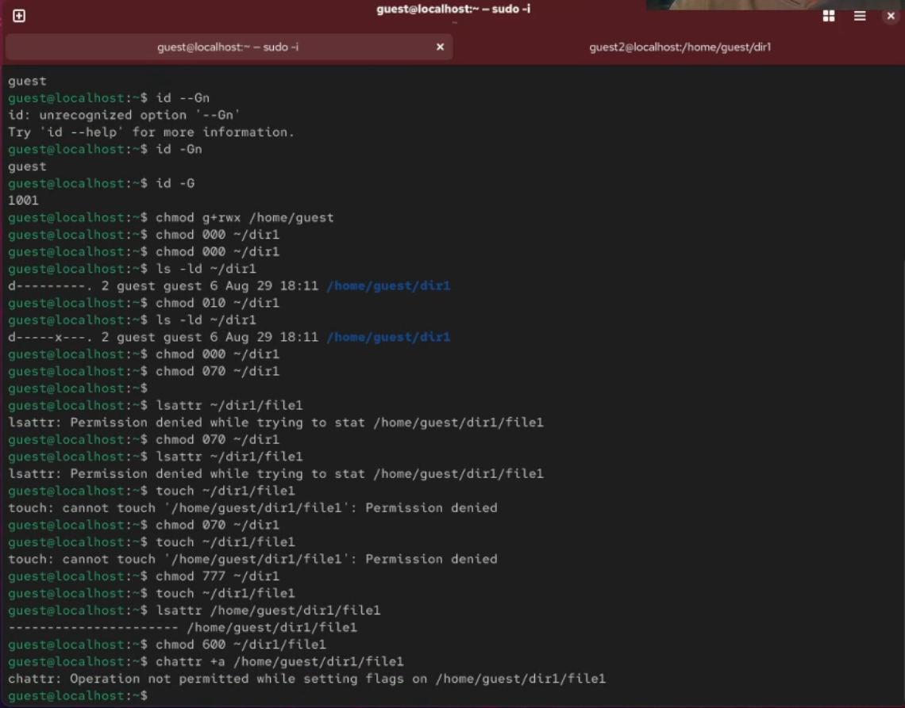{#fig:003}

Устанавливаю права от имени суперпользователя и получается установить атрибут и проверяю работу с помощью lsattr.

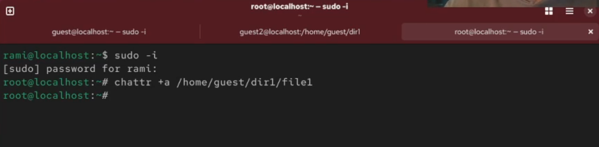{#fig:004}

От пользователя guest проверяю правильность установления атрибута

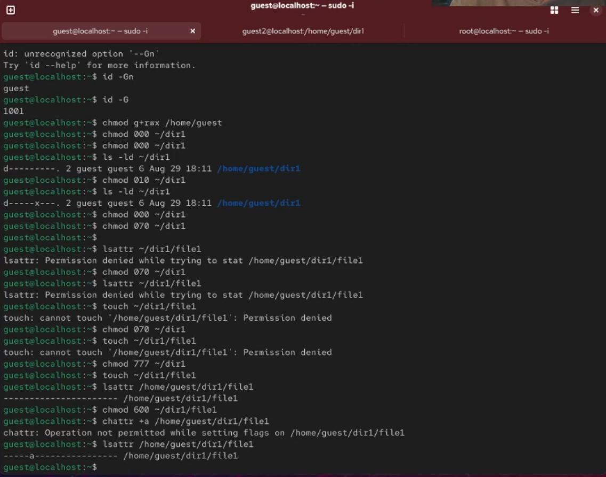{#fig:005}

Выполняю дозапись в файл с помощью echo и проверяю командой cat.

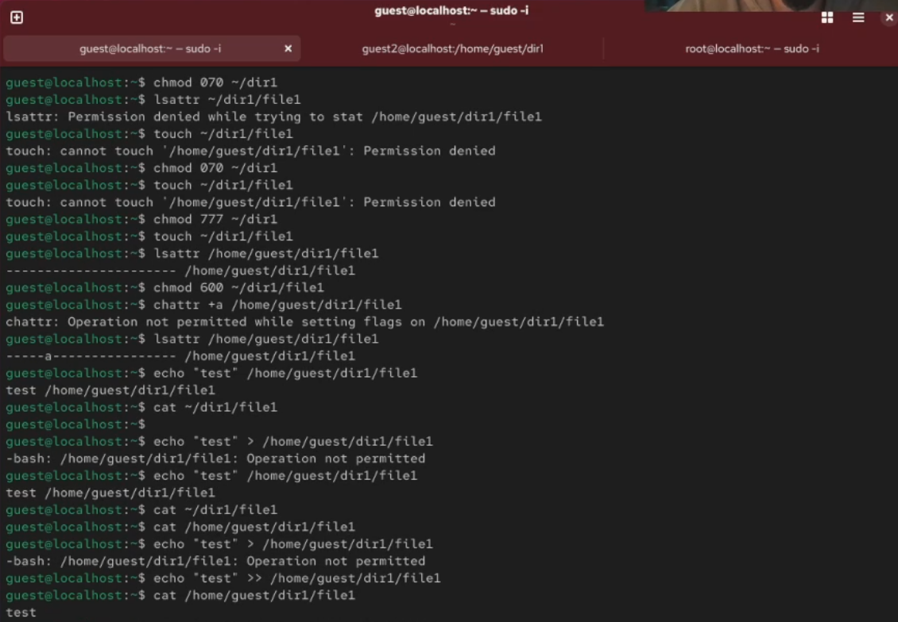{#fig:006}

Пробую стереть имеющуюся в file1 информацию и получаю отказ в ответ. 

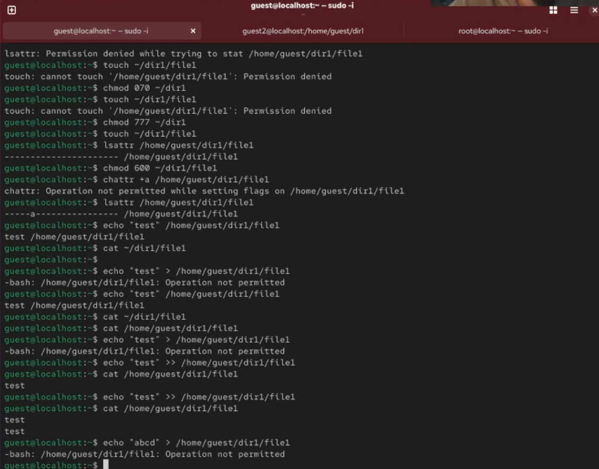{#fig:007}

Получаю отказ при попытке переименовать файл. 

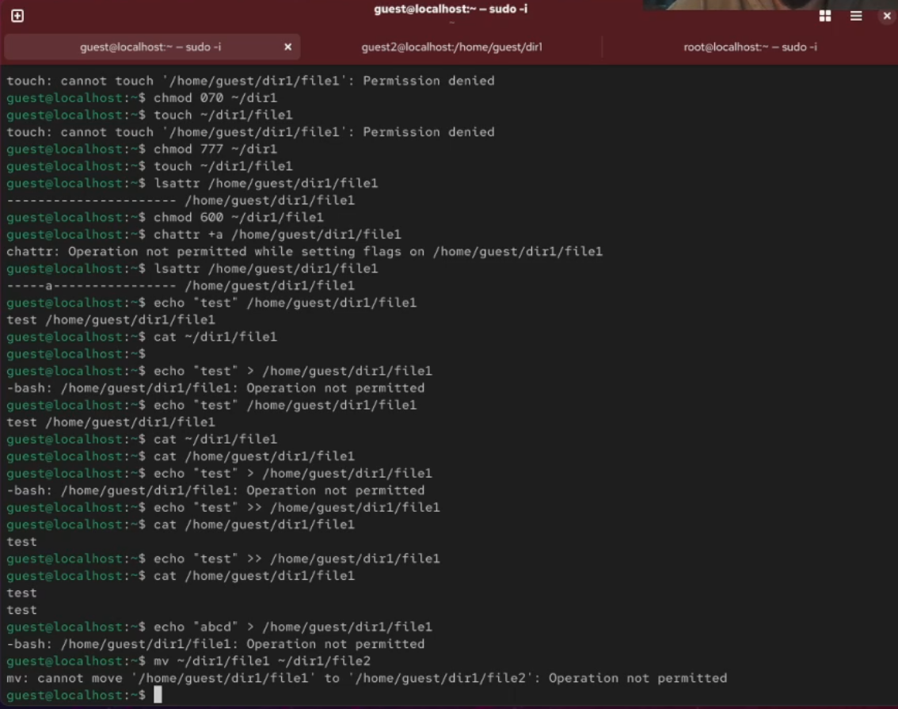{#fig:008}

Когда пытаюсь изменить права доступа также получаю отказ.

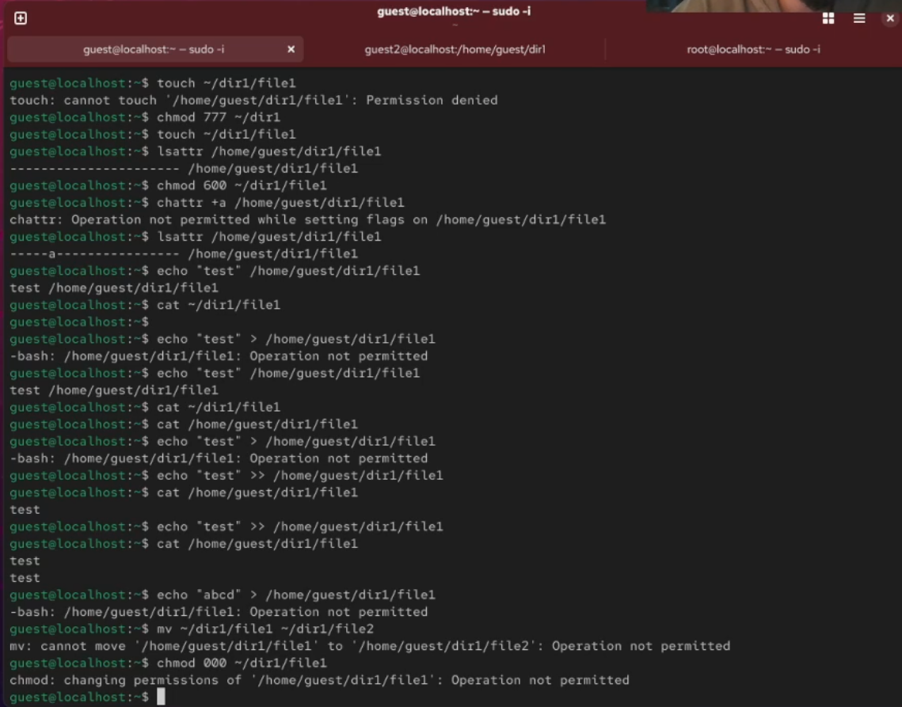{#fig:009}

Снимаю расширенный атрибут с файла.

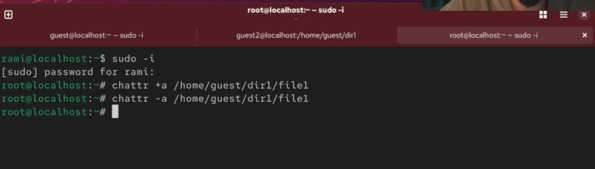{#fig:010}

Проверяю файл на чтение, переименование, изменение прав доступа и выполнение. 

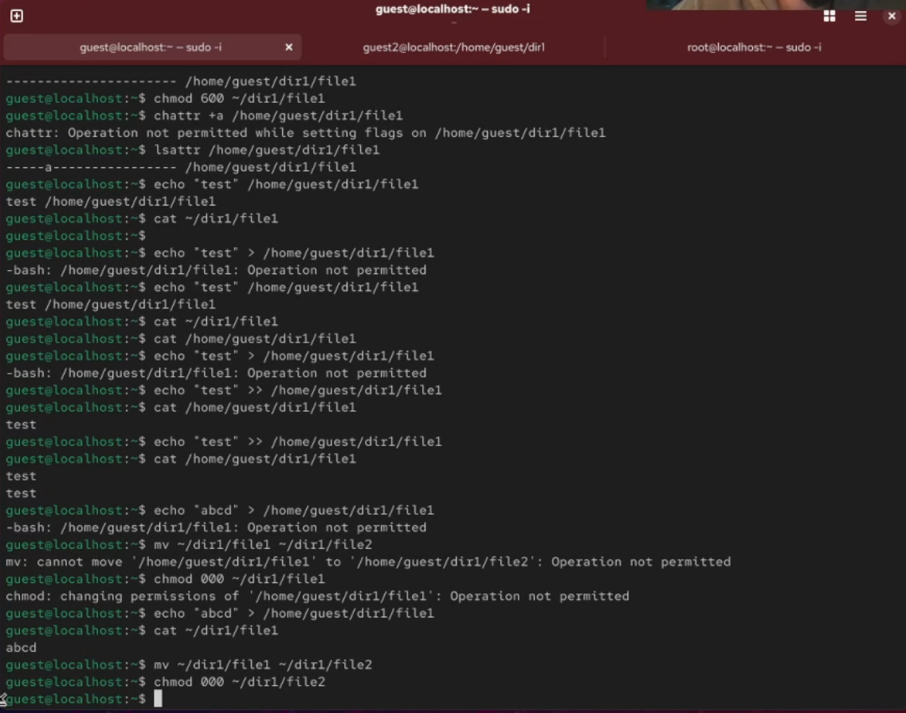{#fig:011}

Далее повторяю все проделанные действия но с расширенный атрибут i.

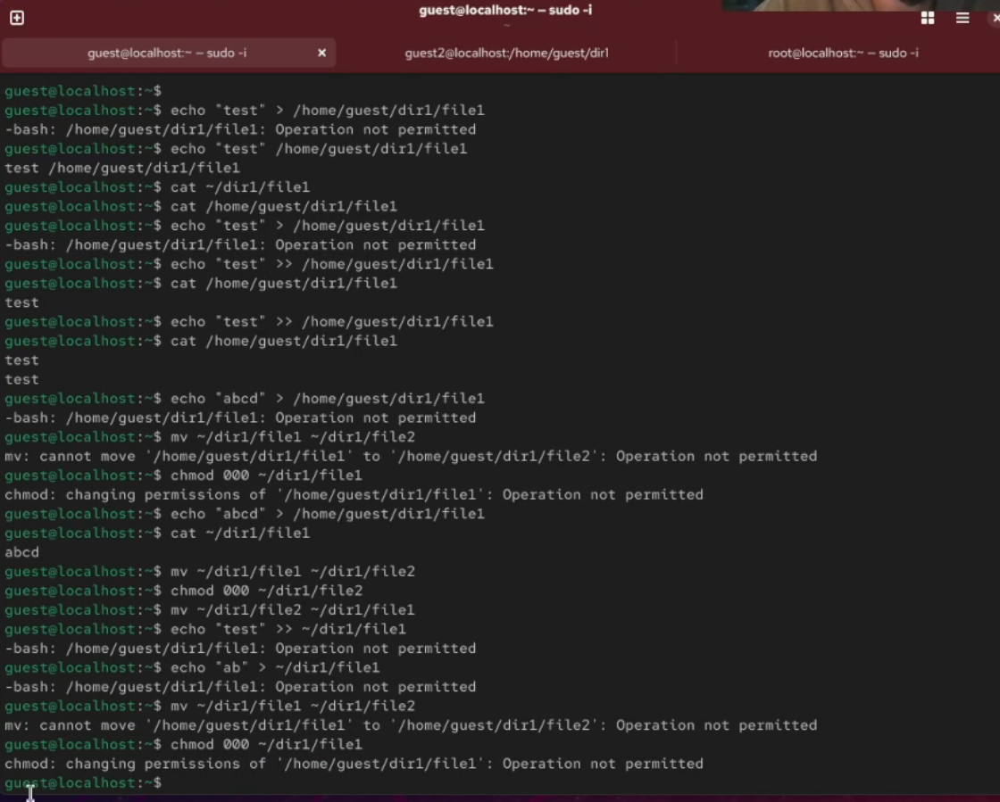{#fig:012}

# Выводы

В результате выполнения работы мы повысили свои навыки использования интерфейса командой строки (CLI), познакомились на примерах с тем, как используются основные и расширенные атрибуты при разграничении
доступа. Имели возможность связать теорию дискреционного разделения доступа (дискреционная политика безопасности) с её реализацией на практике в ОС Linux. Составили наглядные таблицы, поясняющие какие операции возможны при тех или иных установленных правах. Опробовали действие на практике расширенных атрибутов «а» и «i».

# Список литературы

https://esystem.rudn.ru/pluginfile.php/3096711/mod_resource/content/3/004-lab_discret_extattr.pdf

::: {#refs}
:::