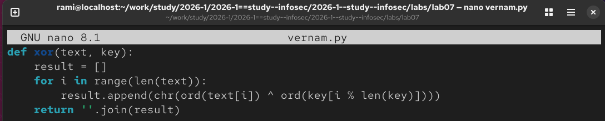
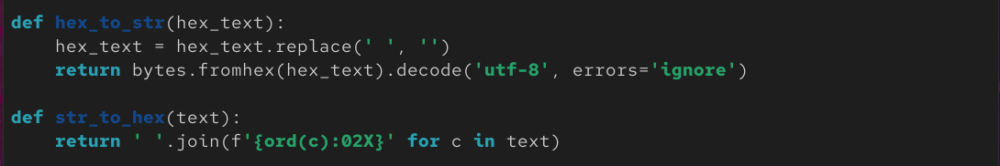
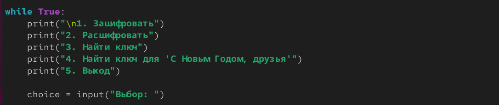

---
## Author
author:
  name: Альманасра Рами
  degrees: студент НКАбд-02-24
  email: 1032235862@rudn.ru
  affiliation:
    - name: Российский университет дружбы народов
      country: Российская Федерация
      postal-code: 117198
      city: Москва
      address: ул. Миклухо-Маклая, д. 6

## Title
title: "Лабораторная работа №7"
subtitle: "Дисциплина: Основы информационной безопасности"
license: "CC BY"
lang: ru
format: typst
---

# Цель работы

Освоить на практике применение режима однократного гаммирования (шифр Вернама) для шифрования и дешифрования данных.

# Выполнение лабораторной работы

Для выполнения работы была разработана программа на языке программирования Python, реализующая шифр Вернама (однократное гаммирование).

Программа использует операцию XOR для шифрования и дешифрования данных. Операция XOR является симметричной, что позволяет использовать одну и ту же функцию для обоих процессов.

{#fig:001}

Для удобства работы с ключами в шестнадцатеричном виде были созданы функции преобразования.

{#fig:002}

Программа предоставляет простое меню для выбора операции.

{#fig:003}

# Выводы

При выполнении данной работы я научился применять режим однократного гарммирования.

# Список литературы

https://esystem.rudn.ru/pluginfile.php/3096717/mod_resource/content/2/007-lab_crypto-gamma.pdf

::: {#refs}
:::