---
## Author
author:
  name: Альманасра Рами
  degrees: студент НКАбд-02-24
  email: 1032235862@rudn.ru
  affiliation:
    - name: Российский университет дружбы народов
      country: Российская Федерация
      postal-code: 117198
      city: Москва
      address: ул. Миклухо-Маклая, д. 6

## Title
title: "Отчёт по индивидуальному проекту этап 2"
subtitle: "Дисциплина: Основы информационной безопасности"
license: "CC BY"
lang: ru
format: typst
---

# Цель работы

Получить практические навыки по установке DVWA.

# Выполнение проекта

Открою терминал, и с помощью cd, вхожу в директорию html, где сохраняются файлы локального хоста. В этой же директории клонирую репозиторий.

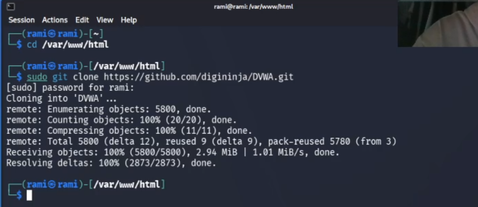{#fig:002}

Используя chmod -R 777, разрешаю все права на все файлы в DVWA

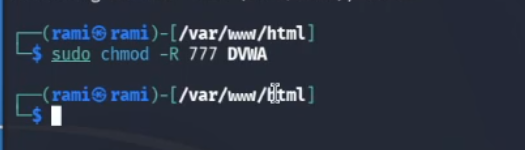{#fig:003}

Далее захожу в dvwa/config, чтобы настроить веб-приложение и копирую config.int.php который содержит конфигурацию приложения.

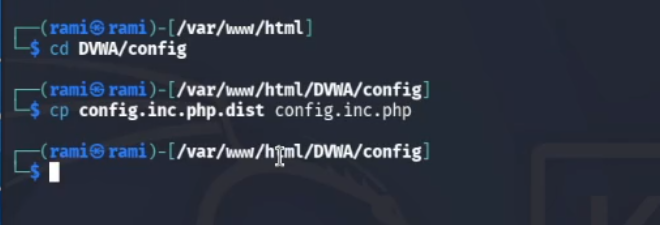{#fig:005}

В этом файле изменяю пароль, имя пользователя на rami и сохраняю изменения.

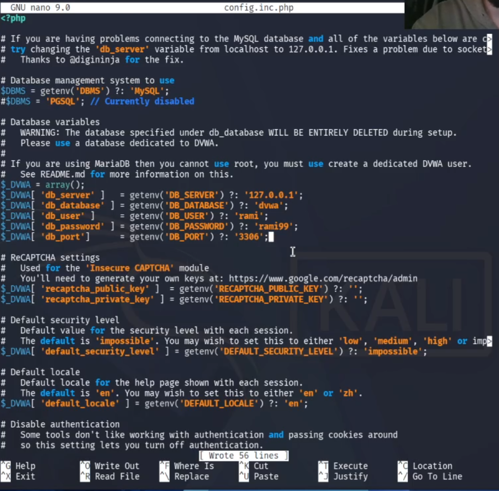{#fig:006}

Устанавливаю обновление и mariadb

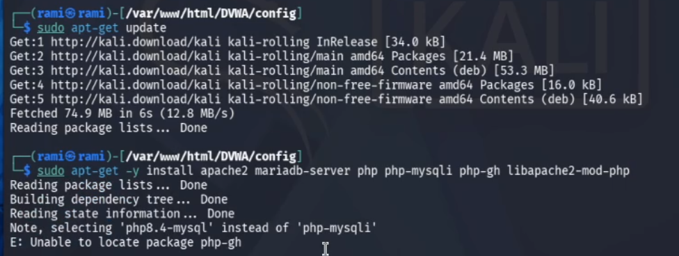{#fig:007}

Запускаю mysql с помощью start mysql.

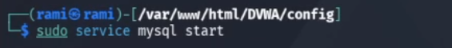{#fig:008}

Далее я вхожу в mmysql используя mysql -u root -p 

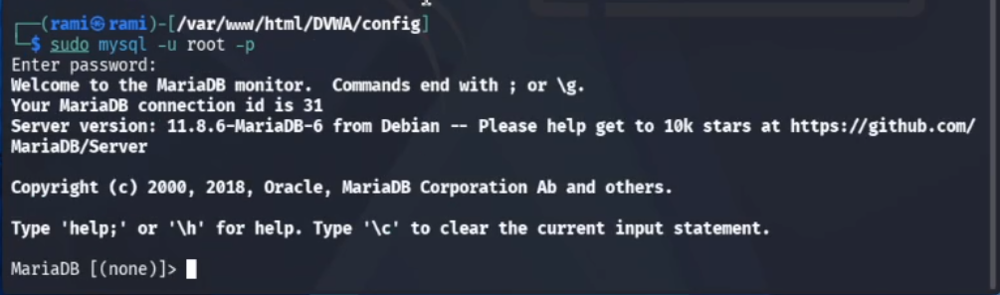{#fig:009}

Создаю нового пользователя используя create user 'rami'@'127.0.0.1' identified by 'rami99'. Используя эту команду, создал пользователя rami, работаюшего на сервер локального хоста (127.0.0.1) и пароль rami99.

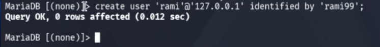{#fig:0011}

Разрешаю все правав доступа этому пользователю к базе данных и завершаю работы.

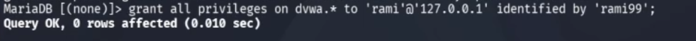{#fig:0012}

Далее вхожу в /etc/php/8.4. и включаю значения allow_url_fopen и allow_url_include в файле apache2/php.ini.

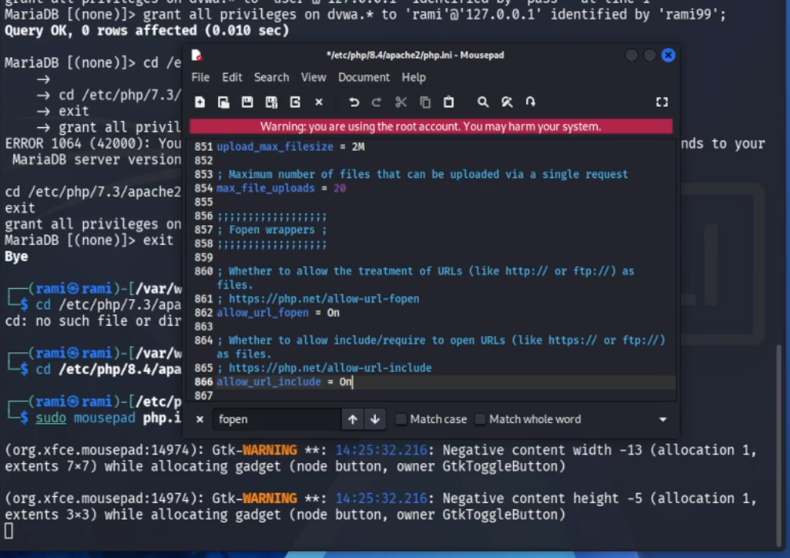{#fig:0015}

Запускаю сервер apache2 испоьзуя service apache2 start. 

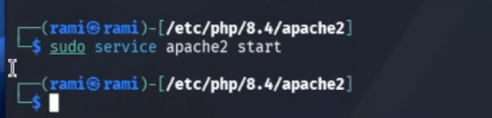{#fig:0016}

Открою 127.0.0.1./dvwa/setup.php в браузере.   

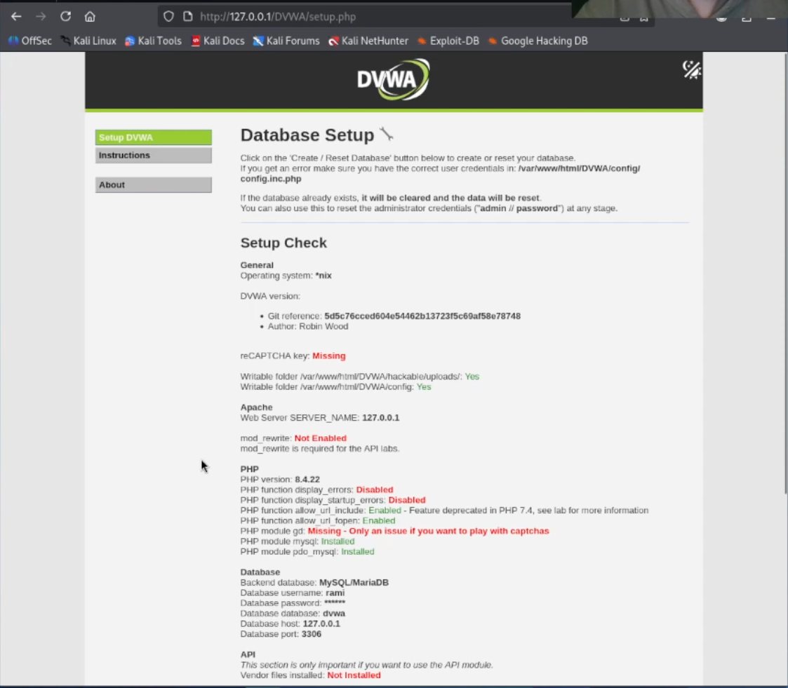{#fig:0017}

Нажимаю кнопку create/Reset database. Создается базу данных и мне перенаправляют на страницу входа. Вхожу используя логин admin и пароль password.

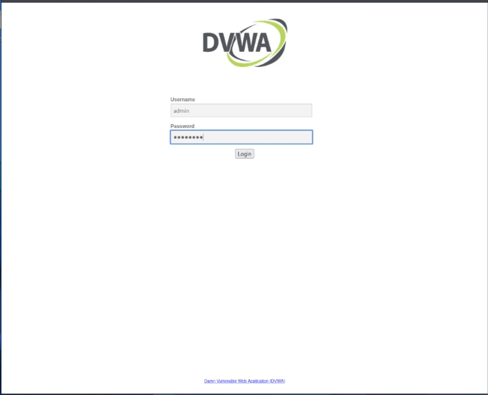{#fig:0018}

После входа попадаем на домашнюю страницу dvwa.

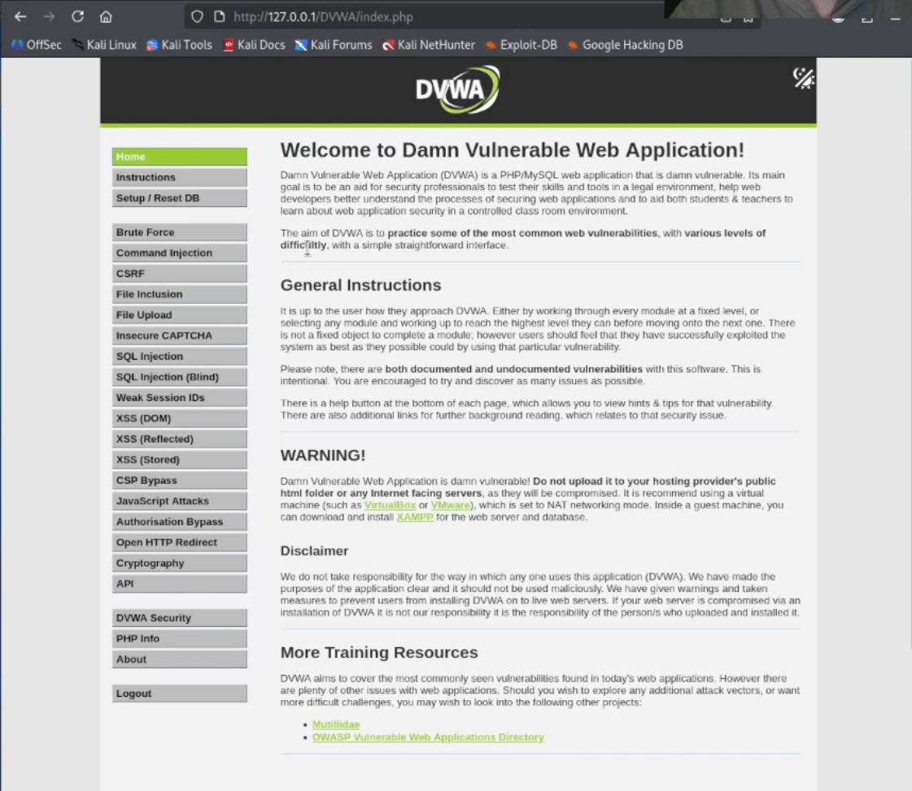{#fig:0019}

# Выводы

Получил навыков по установке DVWA.

# Список литературы

https://esystem.rudn.ru/mod/page/view.php?id=1357901
https://spy-soft.net/dvwa-kali-linux/

::: {#refs}
:::